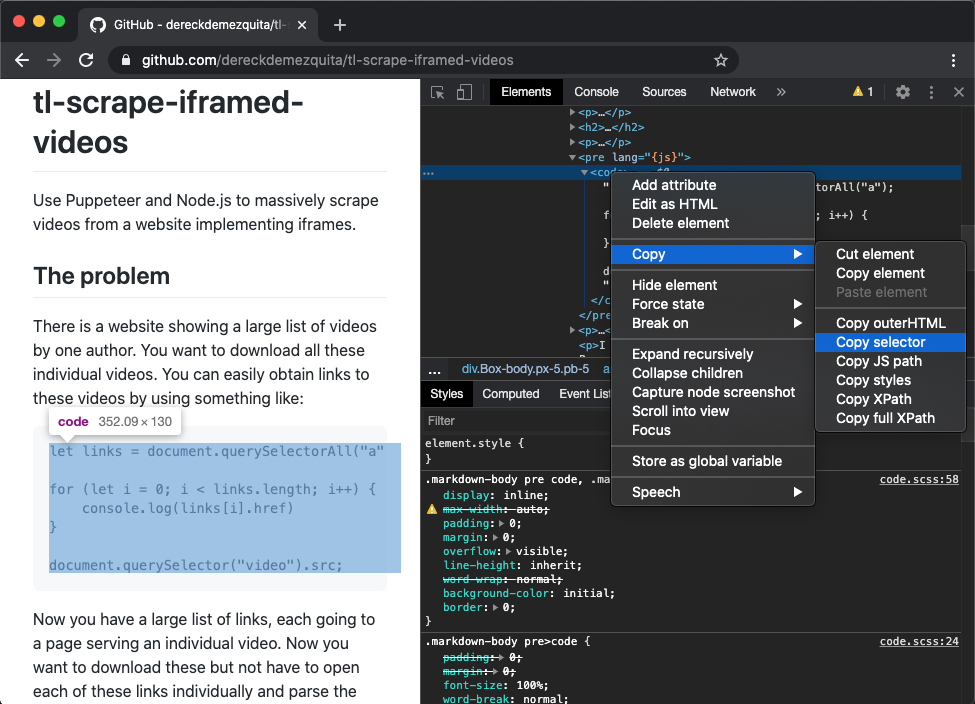

# tl-scrape-iframed-videos

Use Puppeteer and Node.js to massively scrape videos from a website implementing iframes.

## The problem

There is a website showing a large list of videos by one author. You want to download all these individual videos. You can easily obtain links to these videos by using something like:

```{js}
let links = document.querySelectorAll("a");

for (let i = 0; i < links.length; i++) {
    console.log(links[i].href)
}

document.querySelector("video").src;
```

Now you have a large list of links, each going to a page serving an individual video. Now you want to download these but not have to open each of these links individually and parse the `HTML` looking for a `src`. Moreover, the individual pages impliment `iframes`, this makes automation difficult.

I solve this by feeding this list of links to Puppeteer and Node.js.

## Usage

Use the `scrape-video-links.js` script to obtain the links to the individual pages holding our desired videos. Then clean the list and put into an array which is saved to the `config.js` file; this is imported to the `index.js` scraping programme.

Run `index.js`. This writes the direct links to the videos to a `links.json` file. Clean up this file with some simple REGEX, and finally feed to the simple `wget` command:

```{bash}
wget --content-disposition --trust-server-names -i links.json -P videos/
```

## Copy exact selector

<p align="center">
    
</p>
